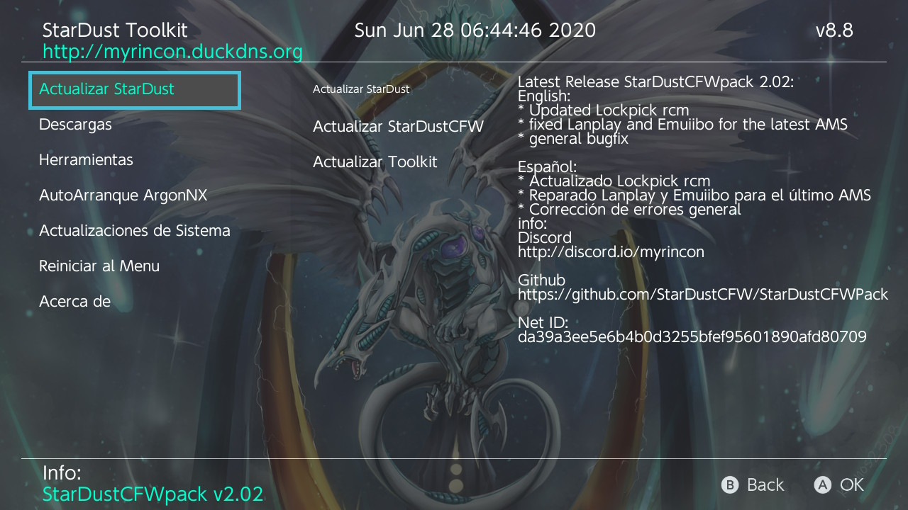

# StarDust-Toolkit

StarDust Toolkit for update and configure [StarDustCFWpack](https://github.com/StarDustCFW/StarDustCFWPack)

https://discord.gg/kscctYj

**Features:**

* Update the StarDustCFWpack
* Update Zenten
* Download cheats and some mods
* LinkUsers integrated
* Get prod.keys
* ArgonNX autoboot
* Download System Updates to sd
* Reboot to payload

**Credits** 
devkitPro for the devkitA64 toolchain. 
Reisyukaku for the code base. - https://github.com/Reisyukaku/ReiNXToolkit 
Retrogamer 74 for part of the code. 
D3fau4 for his help. 
PricelessTwo2 
