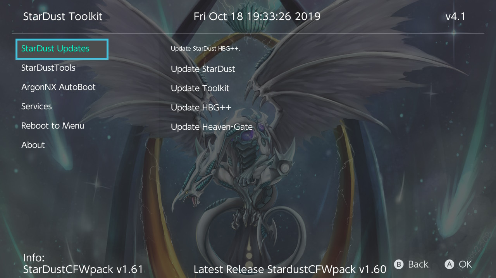
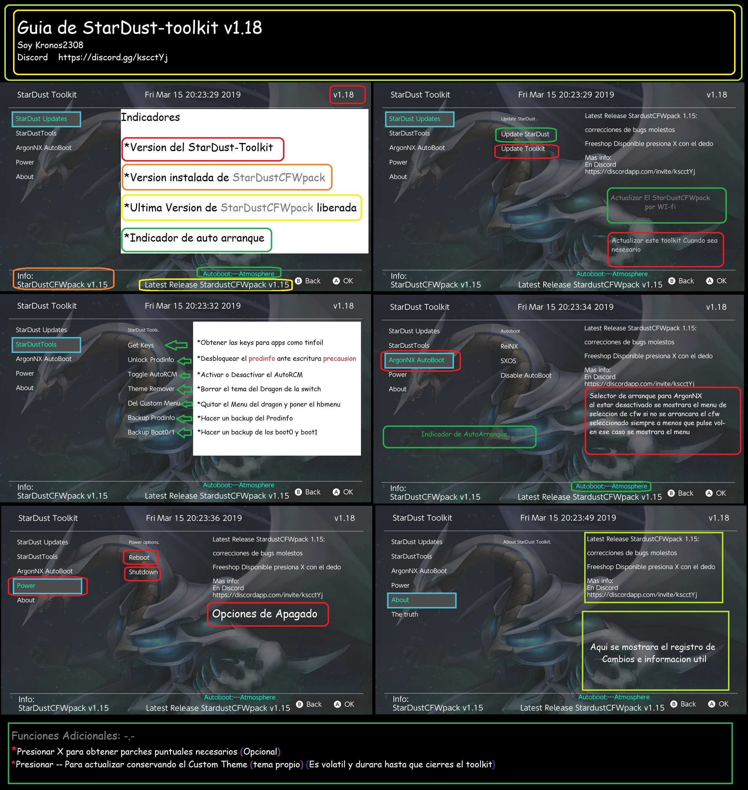

# StarDust-Toolkit

StarDust Toolkit for update and configure StarDustCFWpack
https://github.com/Kronos2308/StarDustCFWPack

https://discord.gg/kscctYj

**Features:**

* Update the StarDustCFWpack

* Toggle AutoRCM

* Dump Cal0/Boot0/Boot1

* Get prod.keys

* ArgonNX autoboot

* Reboot / shutdown

**Credits**

devkitPro for the devkitA64 toolchain.

Reisyukaku for the code base. - https://github.com/Reisyukaku/ReiNXToolkit

Retrogamer 74 for part of the code.

D3fau4 for his help.

PricelessTwo2

And special thanks to Rumba the retrogamer_74 dog

